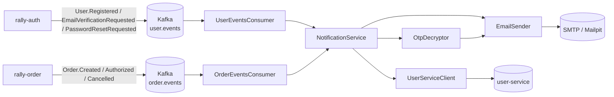

<div align="center">

# Rally Notification

**Event-driven email notification service for the RallyDeals platform**

[](https://adoptium.net/)
[](https://spring.io/projects/spring-boot)
[](https://kafka.apache.org/)
[](https://github.com/RallyDeals/rally-notification/actions)

[Overview](#overview) • [Event flow](#event-flow) • [Getting started](#getting-started) • [Configuration](#configuration) • [Observability](#observability) • [Project structure](#project-structure)

</div>

**Rally Notification** is a Spring Boot microservice that consumes domain events published on Kafka by other RallyDeals services and turns them into transactional emails. It listens on the `user.events` and `order.events` topics and sends welcome, email-verification, password-reset, and order lifecycle notifications using Thymeleaf templates.

## Overview

In the RallyDeals marketplace, services communicate asynchronously through Kafka. When a user registers, requests an OTP, or an order is created, authorized, or cancelled, the owning service publishes a domain event. This service consumes those events, decodes any encrypted payloads (such as OTPs produced by `rally-auth`), resolves the recipient's email address, renders an HTML template, and delivers the message via SMTP.

> [!NOTE]
> During local development, emails are captured by [Mailpit](https://github.com/axllent/mailpit) instead of being delivered. The SMTP traffic is intercepted and displayed in a web UI at `http://localhost:8035`, so you never need a real mailbox to test.

### Features

- **Consumes `user.events`** — sends welcome, email-verification, and password-reset emails
- **Consumes `order.events`** — sends created, authorized, and cancelled order notifications
- **OTP decryption** — decrypts verification/reset codes using the same key material as `rally-auth`
- **Recipient resolution** — looks up the target email via the user service (fake client in `dev`, REST client in `prod`)
- **HTML email templates** — rendered with Thymeleaf, one template per notification type
- **Correlation ID propagation** — carries `X-Correlation-Id` across Kafka consumers and outbound REST calls for end-to-end tracing
- **Observable** — OpenTelemetry spans, Prometheus metrics, Loki logs, and structured logging

## Event flow



Each event carries three Kafka headers that drive processing:

| Header | Purpose |
| --- | --- |
| `X-Type` | Discriminates the event type (e.g. `User.Registered`) and resolves the deserializer target class |
| `X-Id` | Message ID used for logging and deduplication |
| `X-Correlation-Id` | Propagated into MDC, spans, and outbound HTTP calls |

> [!TIP]
> The Kafka listeners deserialize JSON into typed records based on the `X-Type` header via a `JacksonJavaTypeMapper`. Retries use a fixed 1-second backoff (3 attempts) and skip retry for deserialization errors, so malformed messages fail fast without stalling the partition.

### Supported events

| Topic | Event type | Email sent |
| --- | --- | --- |
| `user.events` | `User.Registered` | Welcome email |
| `user.events` | `User.EmailVerificationRequested` | Email verification OTP |
| `user.events` | `User.PasswordResetRequested` | Password reset OTP |
| `order.events` | `Order.Created` | Order created confirmation |
| `order.events` | `Order.Authorized` | Deal join authorized |
| `order.events` | `Order.DealCancelled` | Deal order cancelled |
| `order.events` | `Order.NormalCancelled` | Regular order cancelled |

## Getting started

### Prerequisites

- **Java 21+**
- **Maven 3.9+** (or use the provided `mvnw` wrapper)
- **Docker** (for the local Kafka broker and Mailpit)
- **Git**

### 1. Clone & start infrastructure

```bash
git clone https://github.com/RallyDeals/rally-notification.git
cd rally-notification

# Start Mailpit (SMTP catcher) for local email testing
docker compose up -d mailpit
```

> [!IMPORTANT]
> The Kafka broker must already be running. In the RallyDeals monorepo, Kafka is typically started from `rally-order`'s compose stack. Set `KAFKA_BOOTSTRAP_SERVERS` (or `SPRING_KAFKA_BOOTSTRAP_SERVERS`) to point at it if it isn't on `localhost:9092`.

### 2. Configure environment

Copy the example env file and adjust values to match your setup:

```bash
cp .env.example .env
```

The main knobs are:

| Variable | Default | Description |
| --- | --- | --- |
| `SERVER_PORT` | `8010` | Service HTTP port |
| `KAFKA_BOOTSTRAP_SERVERS` | `localhost:9092` | Kafka broker address |
| `OTP_ENCRYPTION_PASSWORD` | *(see `.env.example`)* | Must match `rally-auth`'s `app.otp.encryption.password` |
| `OTP_ENCRYPTION_SALT` | *(see `.env.example`)* | Must match `rally-auth`'s `app.otp.encryption.salt` |
| `OTEL_EXPORTER_OTLP_ENDPOINT` | *(empty)* | OTLP endpoint for remote trace export, leave empty for local default |
| `LOGGING_LEVEL_RALLY` | `INFO` | Log level for the service's business code |

### 3. Run the service

```bash
./mvnw spring-boot:run
```

The service starts on port `8010`. With the default `dev` profile, the fake `UserServiceClient` returns generated emails (`user-<uuid>@example.com`), so no user service is required. Open the Mailpit UI at `http://localhost:8035` to inspect arriving emails.

> [!NOTE]
> Switch to the `prod` profile to use the real REST-based `UserServiceClient`, which resolves each recipient's email from the user service (`USER_SERVICE_URL`, defaulting to a configurable `user.service.url` property).

## Configuration

The service is configured through `src/main/resources/application.properties`, with all externalizable values overridable via environment variables (loaded from an optional `.env` file).

### Key settings

| Area | Property | Default |
| --- | --- | --- |
| Kafka | `spring.kafka.bootstrap-servers` | `localhost:9092` |
| Kafka | `spring.kafka.consumer.group-id` | `notification-service-group` |
| Mail | `spring.mail.host` | `localhost` |
| Mail | `spring.mail.port` | `1080` |
| Mail | `notification.mail.from` | `no-reply@rally.local` |
| OTP | `app.otp.encryption.password` / `.salt` | *(dev defaults, override in `.env`)* |
| Tracing | `management.opentelemetry.tracing.export.otlp.endpoint` | `http://localhost:4318/v1/traces` |
| Actuator | `management.endpoints.web.exposure.include` | `health,info,metrics,prometheus` |

### Email templates

Templates live in `src/main/resources/templates/email/` and are selected per event type:

```
email/
├── user-registered.html
├── email-verification.html
├── password-reset.html
├── order-created.html
├── order-authorized.html
├── order-deal-cancelled.html
└── order-normal-cancelled.html
```

Each template receives a Thymeleaf `Context` populated with the event's fields (order ID, item list, total price, reason, decrypted OTP, etc.).

## Observability

The service is instrumented end to end:

- **Tracing** — Micrometer + OpenTelemetry tracing is enabled with 100% sampling. Kafka consumers and producers are observed, and a `traceparent` header is automatically propagated. Trace data is exported over OTLP (Jaeger/collector) when configured.
- **Correlation IDs** — `X-Correlation-Id` flows from incoming Kafka headers into MDC, management baggage, and outbound REST calls, so a single request can be followed across services.
- **Logs** — Structured JSON (Logstash encoder) in non-dev profiles, with a plain-text console for local development. Loki appender ships logs to a local or remote Loki endpoint.
- **Metrics** — Micrometer Prometheus registry exposed at `/actuator/prometheus`.

```bash
# Health check
curl http://localhost:8010/actuator/health

# Prometheus metrics
curl http://localhost:8010/actuator/prometheus
```

## Project structure

```
src/main/java/com/rally/notification/
├── RallyNotificationApplication.java     # Spring Boot entry point
├── client/                               # UserServiceClient (fake in dev, REST in prod)
├── config/
│   ├── rest/                             # RestTemplate + tracing interceptor
│   └── kafka/                            # Kafka consumer factory, type mapper
├── dto/                                  # Shared response/event value objects
├── filters/                              # Correlation ID + HTTP logging filters
├── mail/                                 # EmailSender SPI + JavaMail implementation
├── messaging/
│   ├── consumer/                         # Order & user Kafka listeners
│   ├── event/                            # Typed event records
│   └── support/                          # Event type constants
├── security/                             # OTP decryption
└── service/                              # NotificationService (email orchestration)
```

## Related projects

- [rally-common](https://github.com/RallyDeals/rally-common) — shared exceptions, DTOs, and utilities consumed via GitHub Packages
- `rally-auth` — publishes user lifecycle events and defines the OTP encryption key material
- `rally-order` — publishes order lifecycle events and hosts the Kafka broker in its compose stack
